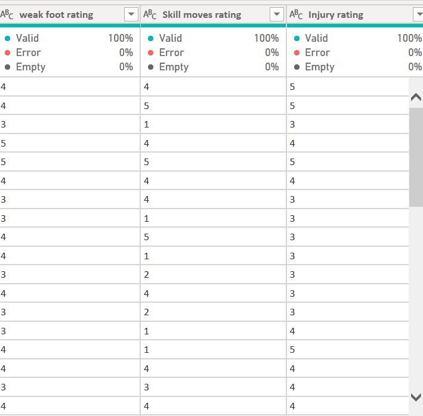

# FIFA21-Data-Cleaning

## Introduction
This is a power BI project which involves the documentation of different **Fifa Players** Worldwide obtained from Kaggle datasets.The data transformation was done in the 
Power query editor. The first step was to get the Data, which prompted me on various ways in which i wanted to get my data. The dataset is in a CSV format which i clicked on and immediately took me to an interface, thereafter i transformed my data into my Power query editor. The dataset contained several column headers that was abbreviated e.g OVA as Overall rating,IR as injury rating,Long name as Players_name and many others. The first transformation that was done was to check the Data dictionary that was provided and i renamed the headers. The dataset contained about 18,979 rows and 76 column headers after transformation. Now lets begin:smiley:

### Photo **URL** Correction
The dataset contained a column that displays the link to the image of each player. I noticed that when i click on the link and go to my browser the image is not displaying. so, the first transformation that was done was to look for the appropraite link through the player url that was provided to correct that error. Here is the link to what it was like before https://cdn.sofifa.com/players/158/023/21_60.png The new link to what it is like now after making data cleaning is below https://cdn.sofifa.net/players/158/023/21_240.png

### BOV,OVA,POT Cleaning
In this section,it was noticed that data that was supposed to be in percentages,were recorded in text.The transformation that was done as regards this was to first divide the values by 100,after then we can convert it to pecentages.In the Power Query editor,under the Transform tab locate the Standard box and then divide the values given,then you have your answer:relieved: 
Below is the image before and after transformation.

### WF,IR,SM Column Cleaning
In this section,it was noticed that a character in the form of a bold star was scraped with the file,and it was my duty to remove the string character that was alongside the value.To perform this tranformation,in my Power Query editor,in the Add Column bar,i reached for the Column from Example icon in other to do the transformation.Below is the Before and After transformation,and of course:sunglasses:i renamed my column header for easy identification.

### Contract Column Transformation
The data cleaning process that was carried out in this section was in different categories.The contract column contained contract start year and end year,informations about the number of years the player spent in the club,and the agreement that each player was under in the club.Below is an image representing what it looked like.

Afterwards,an **Agreement** column was the first transformation that was made.The agreement column was created using an **M-Language**

if Text.Contains([Contract], "Free") then 
    "Free" 
else if Text.Contains([Contract], "Loan") then 
    "Loan" 
else 
    "Contract"
    
 Below, is the interpretation of the **M-Language**
 
 
 
 The second transformation that was made was on the **Duration** column which also was done using an **M-Language**
 
 if Text.Contains([Contract], "~") then
    Number.From(Text.AfterDelimiter([Contract], "~")) - Number.From(Text.BeforeDelimiter([Contract], "~"))
else
    0
    
 Below, is the result to the above **M-Language**
 
 
 
 Finally:tired_face:to get our Sign in Year and Signed out Year, i used the Split column by Delimiter fuction. Which allows you to split column using several characters.The character i wanted was not given,so i used the Custom character and specified it '~'
 

Here is the transformation:point_down:

### Hits Column Transformation
In this column, there were values containing the letter "K"(1.6K) instead of 1600.To achieve this, i removed the value K, and multiplied the remaining values by 1000 
 
Here is an image of what it looked before
 

The resultant is the after of what the column looks like after performing data transformation using the **M-Language** to convert the values back to whole number.
if Text.Contains([Hit], "K") then Number.From(Text.BeforeDelimiter([Hit], "K")) * 1000 else Number.From([Hit])
 

### Values, Release Clause, Wages Column Transformation
Value,Release Clause,and Wage contained string values in each of the column there was a  “€" sign across each columns and they were removed using the same method. I removed this by replacing the _Euro_ sign with **Blank**. The Value and Release Clause column contained "M", and the same process was repeated. I replaced "M" with **Blank** and it was effected in the column. The Wages column contained the value "K"
Here is how the Columns looked like before transformation:expressionless:

**M-Language** was written to covert our values to million and multiply it by the current conversion rate which is 1.06
- Release Clause
(if Text.Contains([Release Clause],"M") then Number.From(Text.BeforeDelimiter([Release Clause],"M"))*1000000 else Number.From(Text.BeforeDelimiter([Release Clause],"K"))*1000)*1.06

- Values 
(if Text.Contains([Value],"M") then Number.From(Text.BeforeDelimiter([Value],"M"))*1000000 else Number.From(Text.BeforeDelimiter([Value],"K"))*1000)*1.06)

- Wages
Wage Column if Text.Contains([Wage], "K") then Number.From(Text.BeforeDelimiter([Wage], "K")) * 1000 * 1.06 else Number.From([Wage]) * 1.06

After all these transformations have been applied to the previous Column, this is what the Column looks like:cowboy_hat_face:

### Heights, Weight Column Tansformation
Here, the height column were recorded in different units of measurements such as cm,inches,feets. To correct this, i ensured to covert all figures to "cm" using the following procedures 
Identify all values in ft/in format using the Text.Contains function,after which separate the feet and inches values using the Text.BetweenDelimiters function.Then convert the feet value to cm by multiplying by 30.48. Convert the inches value to cm by multiplying by 2.54.Thereafter,i converted feet and inches values to get the final height in centimeters (cm).

let 
    cm = if Text.Contains([Height], "cm") then 
            Number.From(Text.BeforeDelimiter([Height], "cm")) 
         else 
            null,
    ft = Number.From(Text.BeforeDelimiter([Height], "'")),
    inch = Number.From(Text.BetweenDelimiters([Height], "'", """)),
    Result = if cm is null then (ft*30.48) + (inch*2.54) else cm
in
    Result
    
For the Weight Column, data entries in this field were recorded in "Kg" which i wanted to convert to pounds(lbs)
The **M-Language** code checks if the Weight column contains “kg” as the unit of measurement. If it does, the value before “kg” is converted from kilograms to pounds (lbs) by multiplying it with 2.204. If the unit of measurement is “lbs”, then the value remains the same

if Text.Contains([Weight], "kg") then
    Number.From(Text.BeforeDelimiter([Weight], "kg")) * 2.204
else
    Number.From(Text.BeforeDelimiter([Weight], "lbs"))
Below, is a representation of what it was before and after conversion :satisfied:

Heights/Weight Before                                                      |Heights/Weight After 
:-----------------------------------------------------------:              |:---------------------------------------------------:
                                                              |

**In Conclusion** This dataset have undergone several transformations,i have been able to perform some **M-Code** to make our cleaning easier and faster. Also, changing dataset types from texts to numeric form, cleaning of missing values to make our Analysis more accurate and error free.Now we can go ahead and Visualize if need be :blush: I really hope that this documentation is going to be helful for future purposes,and anyone working with this Dataset encountering one or more problems. You are Welcome:zany_face:
